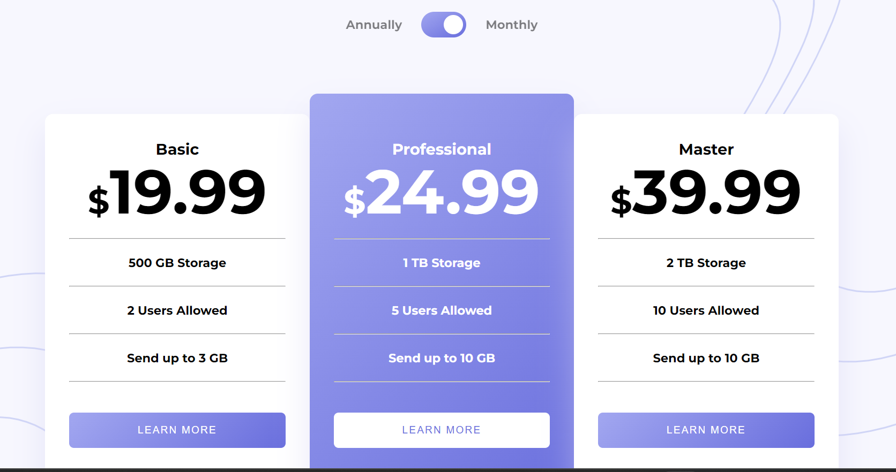

# Frontend Mentor - Pricing component with toggle solution

This is a solution to the [Pricing component with toggle challenge on Frontend Mentor](https://www.frontendmentor.io/challenges/pricing-component-with-toggle-8vPwRMIC). Frontend Mentor challenges help you improve your coding skills by building realistic projects. 

## Table of contents

  - [The challenge]
  - [Screenshot]
  - [Links]
- [My process]
  - [Built with]
  - [Continued development]
- [Author]

### The challenge

Users should be able to:

- View the optimal layout for the component depending on their device's screen size
- Control the toggle with both their mouse/trackpad and their keyboard

### Screenshot

### Links

- Solution URL: (https://github.com/Moulaye-dagnon/pricing-component-react.git)
- Live Site URL: (https://pricing-component-react-moulaye-dagnon.vercel.app/)

### My process
- Mobile first
-then I adapted ot the great srceem

### Built with

- Semantic HTML5 markup
- CSS custom properties
- Flexbox
- Mobile-first workflow
- [React](https://reactjs.org/) - JS library

### Continued development
I will continue with the creation of the conponents for improve my level especially the hooks 

#### Author

- Frontend Mentor - [@Moulaye_dagnon](https://www.frontendmentor.io/profile/Moulaye-dagnon)

